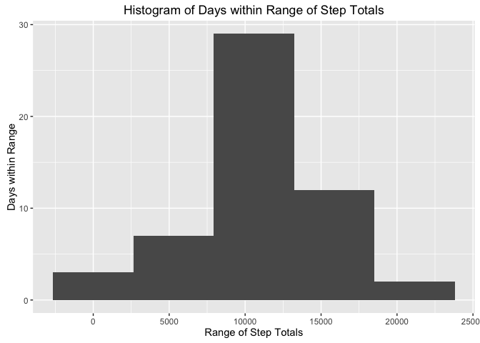
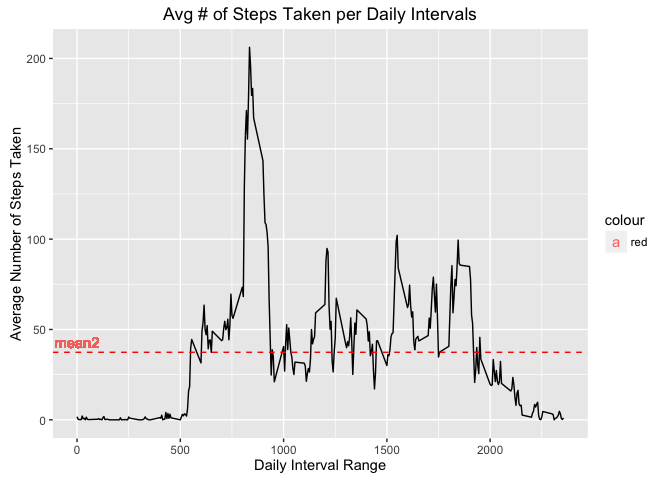
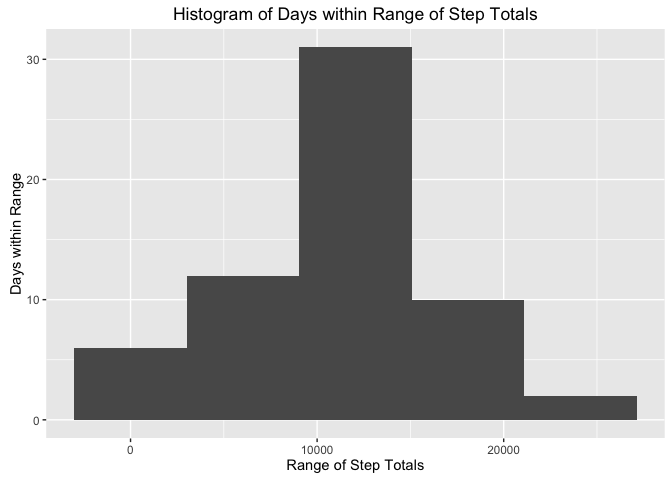
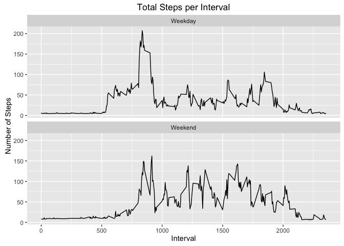

# PA1_template.Rmd
Joaquin Marques  
September 24, 2016  


## Loading and preprocessing the data
#### We first load the activity monitoring data into an activity data frame: 

```r
# default to the right subdirectory
old_wd <- getwd()
setwd("/Users/jmmg57/coursera/RepData_PeerAssessment1")
# Load file into activity data frame
activity <- read.csv(file="activity.csv",head=TRUE,sep=",")
```
#### Then we take a peek at the data. Notice the number of NAs (2304) in steps column:

```r
# Summarize data frame
summary(activity)
```

```
##      steps                date          interval     
##  Min.   :  0.00   2012-10-01:  288   Min.   :   0.0  
##  1st Qu.:  0.00   2012-10-02:  288   1st Qu.: 588.8  
##  Median :  0.00   2012-10-03:  288   Median :1177.5  
##  Mean   : 37.38   2012-10-04:  288   Mean   :1177.5  
##  3rd Qu.: 12.00   2012-10-05:  288   3rd Qu.:1766.2  
##  Max.   :806.00   2012-10-06:  288   Max.   :2355.0  
##  NA's   :2304     (Other)   :15840
```
## What is mean total number of steps taken per day?
#### First, let's load the packages we need, ggplot2 and dplyr,
#### and suppress both warnings and messages related to those packages:

```r
suppressWarnings(library(ggplot2))
suppressWarnings(library(dplyr))
```

```
## 
## Attaching package: 'dplyr'
```

```
## The following objects are masked from 'package:stats':
## 
##     filter, lag
```

```
## The following objects are masked from 'package:base':
## 
##     intersect, setdiff, setequal, union
```

```r
suppressMessages(library(ggplot2))
suppressMessages(library(dplyr))
```
#### Lets group all steps by date, then take mean/median of daily step count ...

```r
step1 <- activity[!is.na(activity$steps),]
step2 <- group_by(step1,date)
step3 <- summarise(step2,daily_step_count = sum(steps))
mean1 <- mean(step3$daily_step_count)
median1 <- median(step3$daily_step_count)
print(paste("The mean of the total number of steps taken per day is",round(mean1,digits=2)))
```

```
## [1] "The mean of the total number of steps taken per day is 10766.19"
```

```r
print(paste("The median of the total number of steps taken per day is",round(median1,digits=2)))
```

```
## [1] "The median of the total number of steps taken per day is 10765"
```
#### ... and plot a histogram of the daily step count

```r
qplot(daily_step_count,
      data=step3,
      bins = 5,  
      main = "Histogram of Days within Range of Step Totals", 
      xlab = "Range of Step Totals",
      ylab = "Days within Range")
```

<!-- -->

## What is the average daily activity pattern?
#### We start with step1 above (activity without NAs), but this time we group by interval,
#### and calculate the average & median number of steps in each interval:

```r
step2 <- group_by(step1,interval)
step3 <- summarise(step2,avg_interval = mean(steps))
mean2 <- mean(step3$avg_interval)
median2 <- median(step3$avg_interval)
print(paste("The mean of the total number of steps taken per day is",round(mean2,digits=2)))
```

```
## [1] "The mean of the total number of steps taken per day is 37.38"
```

```r
print(paste("The median of the total number of steps taken per day is",round(median2,digits=2)))
```

```
## [1] "The median of the total number of steps taken per day is 34.11"
```
#### Finally, we plot the average number of steps taken for each daily interval.
#### Notice that most of the activity is concentrated just around the avg # of steps taken=37.38 
#### red line, which coincides with the mean value we just calculated:

```r
ggplot(step3, 
       aes(interval, avg_interval)) + 
       geom_line() + 
       geom_hline(aes(yintercept = mean2),color="red",linetype="dashed") +
       xlab("Daily Interval Range") + 
       ylab("Average Number of Steps Taken") + 
       ggtitle("Avg # of Steps Taken per Daily Intervals") + 
       geom_text(aes(0, mean2, label="mean2", color="red", vjust=-0.5))
```

<!-- -->

## Imputing missing values
#### First we calculate the number of NAs present in the steps column,
#### and let's verify that it matches the number of Nas (2304) from
#### the summary of the activity dataframe that we found previously:

```r
missing <- is.na(activity$steps)
n_missing <- nrow(activity[missing,])
print(paste("Total number of missing values in the dataset: ",n_missing))
```

```
## [1] "Total number of missing values in the dataset:  2304"
```
#### Next, we choose as a strategy to fill in the missing steps with
#### the mean for each *5-minute interval* from the step3 dataframe we just calculated:

```r
# merge activity and step3 data frames using interval as common column
m1 <- merge(activity,step3,by = intersect(names(activity), names(step3)))
```
#### Now we create a new dataset with missing steps filled in with avg_interval

```r
new_data_set <- activity
new_data_set$steps[missing] <- m1$avg_interval[missing]
```
#### Let's compare the old activity dataset with the new one.
#### Notice how the NAs have been replaced with avg_interval value for each interval:

```r
head(activity)
```

```
##   steps       date interval
## 1    NA 2012-10-01        0
## 2    NA 2012-10-01        5
## 3    NA 2012-10-01       10
## 4    NA 2012-10-01       15
## 5    NA 2012-10-01       20
## 6    NA 2012-10-01       25
```

```r
head(new_data_set)
```

```
##      steps       date interval
## 1 1.716981 2012-10-01        0
## 2 1.716981 2012-10-01        5
## 3 1.716981 2012-10-01       10
## 4 1.716981 2012-10-01       15
## 5 1.716981 2012-10-01       20
## 6 1.716981 2012-10-01       25
```
#### Finally, let's calculate the mean/median of the new "filled-in" dataset:

```r
step2 <- group_by(new_data_set,date)
step3 <- summarise(step2,daily_step_count = sum(steps))
mean3 <- mean(step3$daily_step_count)
median3 <- median(step3$daily_step_count)
print(paste("The new mean of the total number of steps taken per day is",round(mean3,digits=2)))
```

```
## [1] "The new mean of the total number of steps taken per day is 10889.8"
```

```r
print(paste("The new median of the total number of steps taken per day is",round(median3,digits=2)))
```

```
## [1] "The new median of the total number of steps taken per day is 11015"
```
# Do these values differ from the estimates from the first part of the assignment?
#### Comparing the new mean/median values with the original ones, we noticed that
#### both have increased as expected since we have added new intervals that were previously
#### disregarded for having NAs in their steps column:

Measure | New Dataset   | Original Dataset
------- | ------------- | -------------
Mean    | 10889.80 | 10766.19
Median  | 11015.00 | 10765

# What is the impact of imputing missing data on the estimates of the total daily number of steps?
#### Comparing the histogram below with the original one, you will notice an increase in the y values
#### (Days within Range) for Step Totals in ranges below 10000.

```r
qplot(daily_step_count,
      data=step3,
      bins = 5,  
      main = "Histogram of Days within Range of Step Totals", 
      xlab = "Range of Step Totals",
      ylab = "Days within Range")
```

<!-- -->

## Are there differences in activity patterns between weekdays and weekends?
#### Let's add a new column (type) to the new dataset to indicate whether its date column
#### falls on a weekday or a weekend:

```r
new_data_set$date <- as.POSIXct(new_data_set$date)
new_data_set$type  <- as.factor(
                          ifelse(weekdays(new_data_set$date) %in% 
                                           c("Saturday", "Sunday"), 
                                 "Weekend", 
                                 "Weekday"))
```
#### Group by type and interval before ploting the new average daily step counts:

```r
step2 <- group_by(new_data_set,type,interval)
step3 <- summarise(step2,avg_interval = mean(steps))
```
#### Plot average daily step counts for new dataset.
#### - Notice the low daily activity levels up to the 500 min interval and after 2000 on weekdays and the 750 min interval and after 2125 on weekends. These must correspond to the subjects sleeping hours. Subject sleeps later and goes to bed later on weekends, as expected.
#### - On weekdays, activity levels spike during commuting hours (500-900), lunch (1125-1200) and commute back home and dinner (1750-1850), with relatively quiet periods at other times, such as a desk job at an office. 
#### - Subject is much more physically active on average on weekends during the day, except compared with weekday morning commute spike. This is as expected, since subject has the freedom to be out an about on weekends:

```r
ggplot(step3,
       aes(interval, avg_interval)) +
       geom_line() +
       xlab("Interval") +
       ylab("Number of Steps") +
       ggtitle("Total Steps per Interval") +
       facet_wrap(~ type,ncol=1)
```

<!-- -->
